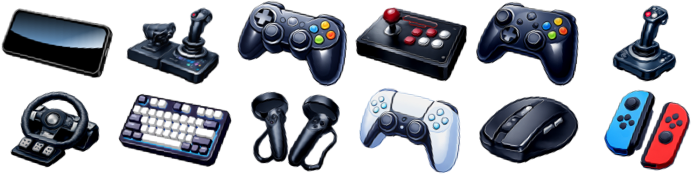

<h1 align="center">PixiJS Input Devices</h1>

<p align="center"><i>Device management, navigation for pointer-based UIs, and named input bindings.</i></p>

<p align="center"><a href="https://github.com/reececomo/pixijs-input-devices/blob/main/LICENSE"></a> <a href="https://github.com/reececomo/pixijs-input-devices/actions/workflows/tests.yml"></a> <a href="https://www.npmjs.com/package/pixijs-input-devices"></a> <a href="https://www.npmjs.com/package/pixijs-input-devices"></a></p>

<p align="center"></p>

<table align="center">
<thead>
<tr>
<th></th>
<th></th>
</tr>
</thead>
<tbody>
<tr>
<td>🎮 <a href="#keyboard">Keyboard</a>, <a href="#gamepaddevice">gamepads</a>, <a href="#custom-devices">or custom</a></td>
<td>✨ Configurable <a href="#named-binds">binds</a></td>
</tr>
<tr>
<td>🔮 Completely customizable</td>
<td>🧭 Navigate <a href="#uinavigation-api">pointer-based UIs</a></td>
</tr>
<tr>
<td>🎼 Haptic-feedback support<sup><a href="https://caniuse.com/mdn-api_gamepad_vibrationactuator">[1]</a></td>
<td>🌐 Fully <a href="#keyboard-layout---detection">international</a></td>
</tr>
<tr>
<td>🍃 Lightweight, zero dependencies</td>
<td>✨ Supports PixiJS v8+</td>
</tr>
</tbody>
</table>


#### Set default binds

```ts
import { KeyboardDevice, GamepadDevice } from "pixijs-input-devices";

KeyboardDevice.configureBinds({
    Jump  : [ "Space" ],
    Left  : [ "KeyA", "ArrowLeft" ],
    Right : [ "KeyD", "ArrowRight" ],
});

GamepadDevice.configureDefaultBinds({
    Jump:   [ "Face1" ],
    Left:   [ "LeftStickLeft",  "DpadLeft" ],
    Right:  [ "LeftStickRight", "DpadRight" ],
});
```

## Basic Usage

```ts
let jump = false;
let moveX = 0;

for (let device of InputDevice.devices)
{
    if (device.bindDown("Jump")) jump = true;
    if (device.bindDown("Left")) moveX = -1;
    if (device.bindDown("Right")) moveX = 1;

    if (device.type === "gamepad")
    {
        // 🎮 dual analog
        if (device.leftJoystick.x) moveX = device.leftJoystick.x;
    }
}
```

#### Events

```ts
// targeted
device.onBindDown("Menu", ({ device }) => { });

// global
InputDevice.onBindDown("Menu", ({ device }) => { });
```

#### Setup bind names

Add the following snippet to set your bind names. Interface keys are ignored, but may be
used for grouping.

```ts
// my-binds.ts

export {};

declare module "pixijs-input-devices"
{
    interface BindValues
    {
        inGame:
            | "Jump"
            | "Left"
            | "Right"
            | "Crouch";

        menu:
            | "Mute"
            | "Pause";
    }

    interface DeviceMetadata
    {
        playerID?: number;
    }
}
```

## 💿 Install

*Everything you need to quickly integrate device management.*

**PixiJS Input Devices** provides an input manager, and a navigation manager that enables
non-pointer devices to navigate pointer-based user interfaces (UIs).

The key concepts are:

1. **Devices:** _Any human interface device_
2. **Binds:** _Custom, named input actions that can be triggered by assigned keys or buttons_
3. **UINavigation:** _Navigation manager for non-pointer devices to navigate UIs_

> [!NOTE]
> _See [UINavigation API](#uinavigation-api) for more information._


## Installation

*Quick start guide.*

**1.** Install the latest `pixijs-input-devices` package:

```sh
# npm
npm install pixijs-input-devices -D

# yarn
yarn add pixijs-input-devices --dev
```

**2.** Register the update loop:

```ts
import { Ticker } from 'pixi.js'
import { InputDevice } from 'pixijs-input-devices'


Ticker.shared.add(() => InputDevice.update())
```

> [!TIP]
> **Input polling:** In the context of a video game, you may want to put the input update at the start of your game event loop instead.

**3.** (Optional) enable the UINavigation API

```ts
const app = new PIXI.Application({ /* … */ });

// Register navigation mixin
registerPixiJSNavigationMixin(PIXI.Container);

// Configure the navigation API on the root container
UINavigation.enable(app.stage);
```

✨ You are now ready to use inputs!

## Features

### InputDevice Manager

The `InputDevice` singleton controls all device discovery.

```ts
InputDevice.keyboard  // Keyboard
InputDevice.gamepads  // GamepadDevice[]
InputDevice.custom    // CustomDevice[]
```

You can access all **active/connected** devices using `.devices`:

```ts
for (const device of InputDevice.devices) {  // …
```

#### InputDevice - properties

The `InputDevice` manager provides the following **context capability** properties:

| Property | Type | Description |
|---|---|---|
| `InputDevice.hasMouseLikePointer` | `boolean` | Whether the context has a mouse/trackpad. |
| `InputDevice.isMobile` | `boolean` | Whether the context is mobile capable. |
| `InputDevice.isTouchCapable` | `boolean` | Whether the context is touchscreen capable. |

As well as shortcuts to **connected devices**:

| Accessor | Type | Description |
|---|---|---|
| `InputDevice.lastInteractedDevice` | `Device?` | The most recently interacted device (or first if multiple). |
| `InputDevice.devices` | `Device[]` | All active, connected devices. |
| `InputDevice.keyboard` | `KeyboardDevice` | The global keyboard. |
| `InputDevice.gamepads` | `GamepadDevice[]` | Connected gamepads. |
| `InputDevice.custom` | `CustomDevice[]` | Any custom devices. |

#### InputDevice - on() Events

Access global events directly through the manager:

```ts
InputDevice.on("deviceadded", ({ device }) => {
    // new device was connected or became available
    // do additional setup here, show a dialog, etc.
})

InputDevice.off("deviceadded") // stop listening
```

| Event | Description | Payload |
|---|---|---|
| `"deviceadded"` | `{device}` | A device has been added. |
| `"deviceremoved"` | `{device}` | A device has been removed. |
| `"lastdevicechanged"` | `{device}` | The _last interacted device_ has changed. |


#### InputDevice - onBind*() Events

You may also subscribe globally to **named bind** events:

```ts
InputDevice
    .onBindDown("MyBind", e => console.debug(e.name + " pressed"))
    .onBindUp("MyBind", e => console.debug(e.name + " released"))
    .onBind("MyBind", e => console.debug(e.name + e.pressed ? " pressed" : " released"));
```

### Keyboard

There is a single global keyboard device.

```ts
import { Keyboard } from "pixijs-input-devices";

if (Keyboard.key.ControlLeft) {  // …
```

`InputDevice` also provides global accessors for `gamepads`, `keyboard` and `custom`.

```ts
import { InputDevice } from "pixijs-input-devices";

if (InputDevice.keyboard.key.ControlLeft) {  // …
if (InputDevice.gamepads[0].button.DpadLeft) {  // …
```

and of course, keyboards can be type-narrowed when iterating through devices:

```ts
if (device.type === "keyboard" && device.key.ControlLeft) {  // …
```

> [!NOTE]
> **Detection:** On mobiles/tablets the keyboard will not appear in `InputDevice.devices` until
> a keyboard is detected. See `keyboard.detected`.

#### Keyboard Layout - detection

```ts
keyboard.layout  // "AZERTY" | "JCUKEN" | "QWERTY" | "QWERTZ"

keyboard.getKeyLabel("KeyZ")  // Я
```

> [!NOTE]
> **Layout support:** Detects the **"big four"** (AZERTY, JCUKEN, QWERTY and QWERTZ).
> Almost every keyboard is one of these four (or a regional derivative &ndash; e.g. Hangeul,
> Kana). There is no built-in detection for specialist or esoteric layouts (e.g. Dvorak, Colemak, BÉPO).
>
> The `keyboard.getKeyLabel(key)` uses the [KeyboardLayoutMap API](https://caniuse.com/mdn-api_keyboardlayoutmap)
> when available, before falling back to default AZERTY, JCUKEN, QWERTY or QWERTZ key values.

The keyboard layout is automatically detected from (in order):

1. Browser API <sup>[(browser support)](https://caniuse.com/mdn-api_keyboardlayoutmap)</sup>
2. Keypresses
3. Browser Language

You can also manually force the layout:

```ts
// force layout
InputDevice.keyboard.layout = "JCUKEN"

InputDevice.keyboard.getKeyLabel("KeyW")  // "Ц"
InputDevice.keyboard.layoutSource  // "manual"
```

#### KeyboardDevice Events

| Event | Description | Payload |
|---|---|---|
| `"layoutdetected"` | `{layout,layoutSource,device}` | The keyboard layout (`"QWERTY"`, `"QWERTZ"`, `"AZERTY"`, or `"JCUKEN"`) has been detected, either from the native API or from keypresses. |
| `"binddown"` | `{name,event,keyCode,keyLabel,device}` | A **named bind** key was pressed. |
| **Key presses:** | | |
| `"KeyA"` | `{event,keyCode,keyLabel,device}` | The `"KeyA"` was pressed. |
| `"KeyB"` | `{event,keyCode,keyLabel,device}` | The `"KeyB"` was pressed. |
| `"KeyC"` | `{event,keyCode,keyLabel,device}` | The `"KeyC"` was pressed. |
| … | … | … |


### GamepadDevice

Gamepads are automatically detected via the browser API when first interacted with <sup>[(read more)](https://developer.mozilla.org/en-US/docs/Web/API/Gamepad_API/Using_the_Gamepad_API)</sup>.

Gamepad accessors are modelled around the "Standard Controller Layout":

```ts
const gamepad = InputDevice.gamepads[0];

if (gamepad.button.DpadDown)
{
    // button pressed
}

if (gamepad.leftTrigger > 0.25)
{
    // trigger pulled
}

if (gamepad.leftJoystick.x < -0.33)
{
    // joystick moved
}
```

> [!TIP]
> **Special requirements?** You can always access `gamepad.source` and reference the
> underlying API directly as needed.

#### Vibration & Haptics

Use the `playHaptic()` method to play a haptic vibration effect on supported devices.

```ts
device.playHaptic({
    duration: 150,
    rumble: 0.75,
    buzz: 0.25,
    rightTrigger: 0.1, // limited support
    // …
});
```

and to cancel all haptics:

```ts
device.stopHaptics();
```

##### Multiple simultaneous haptics on Gamepads

Haptic vibrations automatically combine, so you can execute complex haptic patterns.

```ts
device.playHaptic({ duration: 150, buzz: 0.75 });
device.playHaptic({ duration: 500, rumble: 0.5 });
device.playHaptic({ duration: 250, rumble: 1.0 });
device.playHaptic({
    startDelay: 450,
    duration: 300
    leftTrigger: 0.25,
    rightTrigger: 0.25,
    buzz: 1.0,
    rumble: device.supportsTriggerRumble ? 0.5 : 1.0,
});
```

> [!TIP]
> **Configure gamepad vibration:** On gamepads you can use `device.options.vibration.enabled`
> and `device.options.vibration.intensity` to control vibration.

#### Gamepad Button Codes

The gamepad buttons reference **Standard Controller Layout**:

| Button # | GamepadCode | Description | Xbox Series X | Playstation 5 DualSense® | Nintendo Switch™ Pro |
|:---:|:---|:---|:---:|:---:|:---:|
| `0` | `"Face1"` | **Face Button 1** | A | Cross | B |
| `1` | `"Face2"` | **Face Button 2** | B | Circle | A |
| `2` | `"Face3"` | **Face Button 3** | X | Square | Y |
| `3` | `"Face4"` | **Face Button 4** | Y | Triangle | X |
| `4` | `"LeftShoulder"` | **Left Shoulder** | LB | L1 | L |
| `5` | `"RightShoulder"` | **Right Shoulder** | RB | R1 | R |
| `6` | `"LeftTrigger"` | **Left Trigger** | LT | L2 | ZL |
| `7` | `"RightTrigger"` | **Right Trigger** | RT | R2 | ZR |
| `8` | `"Back"` | **Back** | View | Options | Minus |
| `9` | `"Start"` | **Start** | Menu | Select | Plus |
| `10` | `"LeftStickClick"` | **Left Stick (Click)** | LSB | L3 | L3 |
| `11` | `"RightStickClick"` | **Right Stick (Click)** | RSB | R3 | R3 |
| `12` | `"DpadUp"` | **D-Pad Up** | ⬆️ | ⬆️ | ⬆️ |
| `13` | `"DpadDown"` | **D-Pad Down** | ⬇️ | ⬇️ | ⬇️ |
| `14` | `"DpadLeft"` | **D-Pad Left** |  ⬅️ | ⬅️ | ⬅️ |
| `15` | `"DpadRight"` | **D-Pad Right** | ➡️ | ➡️ | ➡️ |

#### Gamepad Axis Codes

Bindable helpers are available for the joysticks too:

| Axis # | GamepadCode | Standard | Layout
|:---:|:---:|:---:|:---:|
| `0` | `"LeftStickLeft"`<br/>`"LeftStickRight"` | **Left Stick (X-Axis)** | ⬅️➡️ |
| `1` | `"LeftStickUp"`<br/>`"LeftStickDown"` | **Left Stick (Y-Axis)** | ⬆️⬇️ |
| `2` | `"RightStickLeft"`<br/>`"RightStickRight"` | **Right Stick (X-Axis)** | ⬅️➡️ |
| `3` | `"RightStickUp"`<br/>`"RightStickDown"` | **Right Stick (Y-Axis)** | ⬆️⬇️ |

> [!TIP]
> Set the `joystick.pressThreshold` option in `GamepadDevice.defaultOptions` to adjust event sensitivity.

#### Gamepad Layouts

```ts
gamepad.layout // "xbox_one"
```

Gamepad device layout reporting is a non-standard API, and should only be used for aesthetic
enhancements improvements (i.e. [display layout-specific icons](https://thoseawesomeguys.com/prompts/)).

#### GamepadDevice Events

| Event | Description | Payload |
|---|---|---|
| `"binddown"` | `{name,button,buttonCode,device}` | A **named bind** button was pressed. |
| **Button presses:** | | |
| `"Face1"` | `{button,buttonCode,device}` | Standard layout button `"Face1"` was pressed. Equivalent to `0`. |
| `"Face2"` | `{button,buttonCode,device}` | Standard layout button `"Face2"` was pressed. Equivalent to `1`. |
| `"Face3"` | `{button,buttonCode,device}` | Standard layout button `"Face3"` was pressed. Equivalent to `2`. |
| … | … | … |
| **Button presses (no label):** | | |
| `0` or `Button.A` | `{button,buttonCode,device}` | Button at offset `0` was pressed. |
| `1` or `Button.B` | `{button,buttonCode,device}` | Button at offset `1` was pressed. |
| `2` or `Button.X` | `{button,buttonCode,device}` | Button at offset `2` was pressed. |
| … | … | … |

### Custom Devices

You can add custom devices to the device manager so it will be polled togehter and included in `InputDevice.devices`.

```ts
import { type CustomDevice, InputDevice } from "pixijs-input-devices"

export const onScreenButtonsDevice: CustomDevice = {
    type: "custom",
    id: "OnScreen",
    meta: {},
    update: (now: number) => {
        // polling update
    }
};

InputDevice.add(onScreenButtonsDevice);
```

## Named Binds

Use _named binds_ to create mappings between abstract inputs and the keys/buttons that trigger those inputs.

This allows you to change the keys/buttons later (e.g. allow users to override inputs).

```ts
// keyboard:
InputDevice.keyboard.configureBinds({
    jump: [ "ArrowUp", "Space", "KeyW" ],
    crouch: [ "ArrowDown", "KeyS" ],
    toggleGraphics: [ "KeyB" ],
})

// all gamepads:
GamepadDevice.configureDefaultBinds({
    jump: [ "Face1", "LeftStickUp" ],
    crouch: [ "Face2", "Face3", "RightTrigger" ],
    toggleGraphics: [ "RightStickUp", "RightStickDown" ],
})
```

These can then be used with either the real-time and event-based APIs.

#### Event-based:

```ts
// listen to ANY device:
InputDevice.onBindDown("toggleGraphics", (e) => toggleGraphics())

// listen to specific devices:
device.onBindDown("Jump", (e) => doJump())
```

#### Real-time:

```ts
let jump = false, crouch = false, moveX = 0

const keyboard = InputDevice.keyboard
if (keyboard.bindDown("Jump")) jump = true
if (keyboard.bindDown("crouch")) crouch = true
if (keyboard.key.ArrowLeft) moveX = -1
else if (keyboard.key.ArrowRight) moveX = 1

for (const gamepad of InputDevice.gamepads) {
    if (gamepad.bindDown("Jump")) jump = true
    if (gamepad.bindDown("crouch")) crouch = true

    // gamepads have additional analog inputs
    // we're going to apply these only if touched
    if (gamepad.leftJoystick.x != 0) moveX = gamepad.leftJoystick.x
    if (gamepad.leftTrigger > 0) moveX *= (1 - gamepad.leftTrigger)
}
```

## UINavigation API

_Traversing a pointer-based UI using input devices._

### Quick setup

Set up navigation once using:

```ts
UINavigation.enable(app.stage)  // any root container
registerPixiJSNavigationMixin(PIXI.Container)
```

Navigation should now work automatically if your buttons handle these events:

- `"pointerdown"`, `"pointerup"` or `"pointertap"` &ndash; i.e. Trigger / show press effect
- `"pointerenter"` or `"pointerover"` &ndash; i.e. Select / show hover effect
- `"pointerleave"` or `"pointerout"` &ndash; i.e. Deselect / reset

You can override these mappings manually:

```ts
// defaults:
UINavigation.options.events.focus   = [ "pointerenter", "pointerover" ];
UINavigation.options.events.blur    = [ "pointerleave", "pointerout" ];
UINavigation.options.events.press   = [ "pointerdown" ];
UINavigation.options.events.release = [ "pointerup", "pointertap" ];
```

> [!TIP]
> 🖱️ **Seamless navigation:** Manually set `UINavigation.focusTarget = <target>`
> inside any `"pointerover"` handlers to allow mouse/pointers to update the
> navigation context for all devices.

> [!TIP]
> **Auto-focus:** Set a container's `navigationPriority` to a value above `0`
> to become the default selection in a context.

### Spatial navigation

By default the "NavigateUp", "NavigateLeft", "NavigateRight" and "NavigateDown" events
use global screen space to move to the nearest UI in that direction, using a heuristic.

### Explicit navigation links:

However for tricky UIs you can manually bind navigation links for containers:

```ts
button1.navigationLinks.up = button2;
```

### How it works

The Navigation API is centered around the **UINavigation** manager, which
receives navigation intents from devices and forwards it to the UI context.

The **UINavigation** manager maintains a stack of responders, which can be a
`Container`, or any object that implements the `NavigationResponder` interface.

When a device sends a navigation intent, the **UINavigation** manager is
responsible for asking the **first responder** whether it can handle the intent.

If it returns `false`, any other responders are checked (if they exist),
otherwise the default global navigation behavior kicks in.

### Container Navigatability

Containers are extended with a few properties/accessors:

| Container properties | type | default | description
|---------------------|------|---------|--------------
| `navigatable`      | `readonly boolean` | `false` | returns `true` if `navigationMode` is set to `"always"`, |or is `"auto"` and is interactive with at least one of "pointertap", "pointerup" or "pointerdown".
| `navigationMode`     | `"auto"` \| `"always"` | `"none"` \| `"auto"` | When set to `"auto"`, a `Container` can be navigated to if it is int
| `navigationPriority` | `number` | `0` | The priority relative to other navigation items in this group.

### Default Binds

The keyboard and gamepad devices are preconfigured with the following binds, feel free to modify them:

Navigation Intent Bind | Keyboard | Gamepad
---|---|---
`"NavigateLeft"` | "ArrowLeft", "KeyA" | "DpadLeft", "LeftStickLeft"
`"NavigateRight"` | "ArrowRight", "KeyD" | "DpadRight", "LeftStickRight"
`"NavigateUp"` | "ArrowUp", "KeyW" | "DpadUp", "LeftStickUp"
`"NavigateDown"` | "ArrowDown", "KeyS" | "DpadDown", "LeftStickDown"
`"NavigateActivate"` | "Enter", "Space" | "Face1"
`"NavigateBack"` | "Escape", "Backspace" | "Face2", "Back"

### Manual control for submenus & modal views

You can manually take control of navigation using:

```ts
// take control
UINavigation.pushResponder(myModalView)

// relinquish control
UINavigation.popResponder()
```

## Advanced usage

### Local Player Assignment

Use the `<device>.meta` property to set assorted meta data on devices as needed.

You lose TypeScript's nice strong types, but its very handy for things like user assignment in multiplayer games.

```ts
InputDevice.on("deviceconnected", ({ device }) =>
    // assign!
    device.meta.localPlayerId = 123
)

for (const device of InputDevice.devices)
{
    if (device.meta.localPlayerId === 123)
    {
        // use assigned input device!
    }
}
```

### On-Screen Inputs

You can easily map an on-screen input device using the `CustomDevice` interface.

```ts
import { CustomDevice, NamedBind } from "pixijs-input-devices";

export class VirtualInputDevice extends Container implements CustomDevice
{
    type = "custom" as const;
    id   = "virtual-gamepad";
    meta = {};

    // example game input:
    input = { moveX: 0, jump: false }; 

    // views:
    joystick = new GameJoystick({ parent: this, x: -200 });
    button1 = new GameButton({ parent: this, x: 300 });

    update(now)
    {
        this.input.moveX = this.joystick.x;
        this.input.jump = this.button1.pressed;
    }

    // (Optional) integrate named binds
    bindDown(name: NamedBind): boolean
    {
        switch (name) {
            case "Jump":
                return this.button1.pressed;

            case "Left":
                return this.joystick.x < 0.5;

            case "Right":
                return this.joystick.x > 0.5;

            default:
                return false;
        }
    }
}

const myDevice = new VirtualInputDevice();

// enable device
InputDevice.add(myDevice);
myDevice.on("destroyed", () => InputDevice.remove(myVirtualDevice))

// (Optional) participate in named binds, including navigation:
myDevice.joystick
    .on("pointermove", debounce(50, () => {
        if (myDevice.joystick.x < 0.5) InputDevice.emitBind("NavigateLeft", myDevice);
        if (myDevice.joystick.x > 0.5) InputDevice.emitBind("NavigateRight", myDevice);
        if (myDevice.joystick.y < 0.5) InputDevice.emitBind("NavigateUp", myDevice);
        if (myDevice.joystick.y > 0.5) InputDevice.emitBind("NavigateDown", myDevice);
    }));

myDevice.button1
    .on("pointertap", () => InputDevice.emitBind("NavigateActivate", myDevice));
```

### Two Users; One Keyboard

You could set up multiple named inputs:

```ts
InputDevice.keyboard.configureBinds({
    Jump    : [ "ArrowUp", "KeyW" ],
    Crouch  : [ "ArrowDown", "KeyS" ],
    Left    : [ "ArrowLeft", "KeyA" ],
    Right   : [ "ArrowRight", "KeyD" ],

    P1_Jump     : [ "KeyW" ],
    P1_Crouch   : [ "KeyS" ],
    P1_Left     : [ "KeyA" ],
    P1_Right    : [ "KeyD" ],

    P2_Jump     : [ "ArrowUp" ],
    P2_Crouch   : [ "ArrowDown" ],
    P2_Left     : [ "ArrowLeft" ],
    P2_Right    : [ "ArrowRight" ]
})
```

and then switch groups depending on the mode/player:

```ts
if (SINGLE_PLAYER_MODE)
{
    player.jump   = device.bindDown("Jump");
    player.defend = device.bindDown("Crouch");
    player.moveX += device.bindDown("Left") ? -1 : 0;
    player.moveX += device.bindDown("Right") ? 1 : 0;
}
else if (player.id === 1)
{
    player.jump   = device.bindDown("P1_Jump");
    player.defend = device.bindDown("P1_Crouch");
    player.moveX += device.bindDown("P1_Left") ? -1 : 0;
    player.moveX += device.bindDown("P1_Right") ? 1 : 0;
}
else
{
    player.jump   = device.bindDown("P2_Jump");
    player.defend = device.bindDown("P2_Crouch");
    player.moveX += device.bindDown("P2_Left") ? -1 : 0;
    player.moveX += device.bindDown("P2_Right") ? 1 : 0;
}
```
